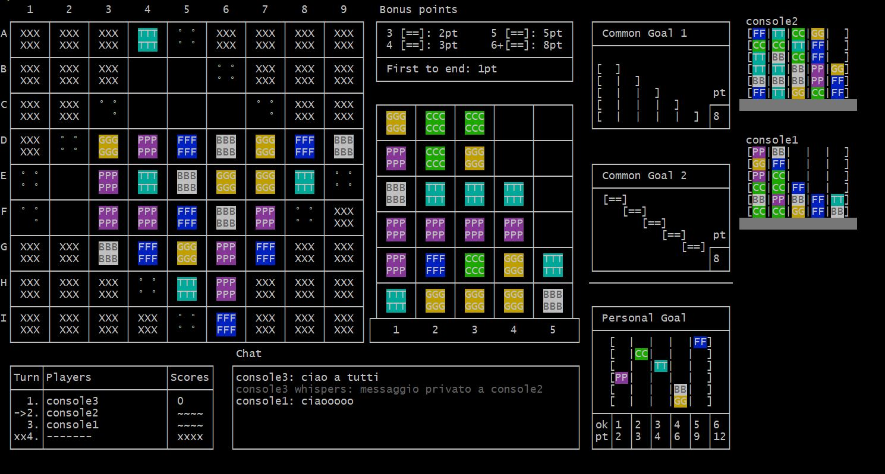
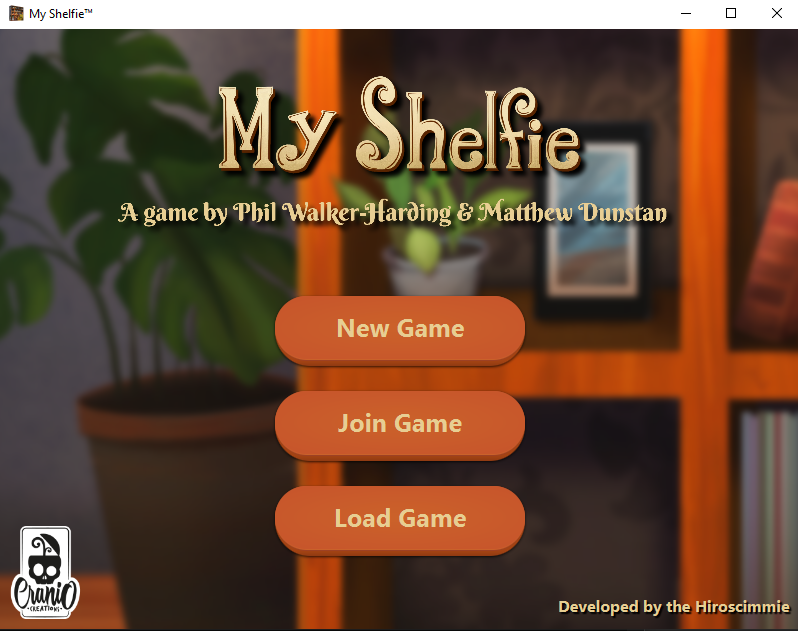
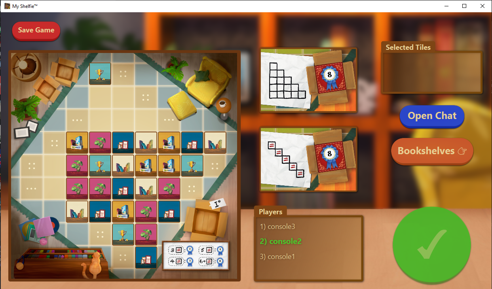
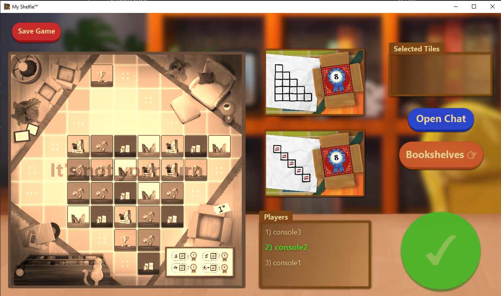
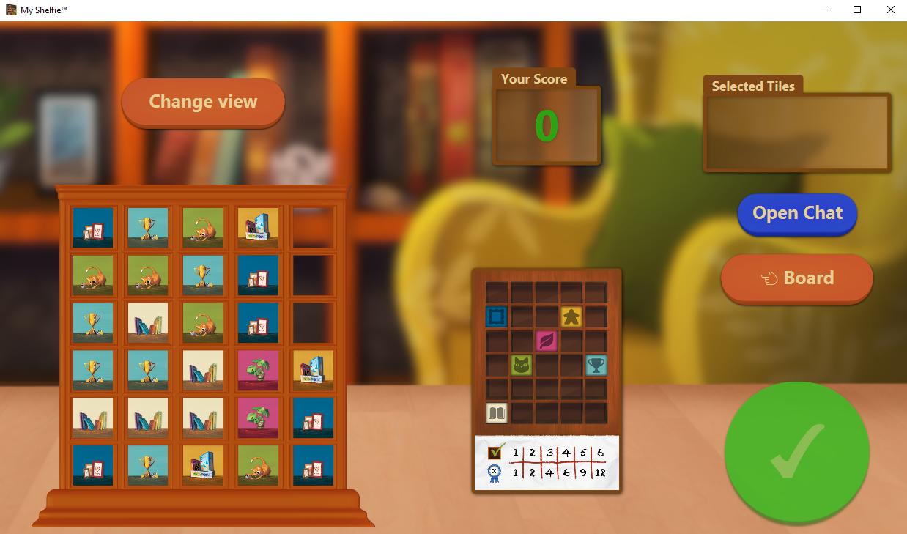
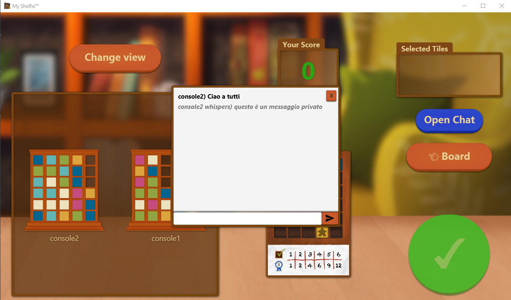
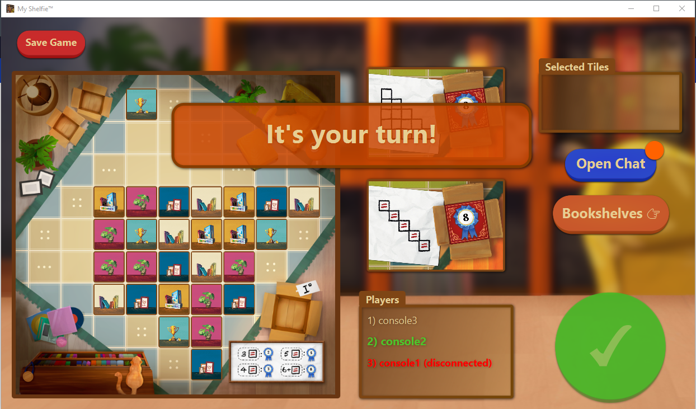

# Corso Ingegneria del Software 2023 - Cremona

#### Abstract 
Sviluppo di un programma distribuito per la simulazione del gioco da tavolo "MyShelfie" come descritto dalle 
regole.  
Il programma è sviluppato in linguaggio Java ed utilizza la libreria JavaFX per la componente grafica. 

---
### Avvio e uso del programma 
Una volta scaricata la cartella del progetto, è disponibile all'interno della cartella `/deliverable/game` il jar per l'avvio del gioco.   
Il gioco può essere avviato in 3 modalità differenti:
1. Modalità server: implementa tutte le funzionalità di gestione dei dati e di comunicazione con i client; 
2. Modalità CLI: interfaccia testuale semplificata che permette di giocare mediante comandi (testuali); 
3. Modalità GUI: interfaccia grafica. 

Per avviare le varie versioni sono necessari i seguenti comandi da terminale: 
- Server: `java -jar myShelfie.jar --server`;
- CLI: `java -jar -Difile.encoding=utf-8 myShelfie.jar --cli --server-addr [server-ip]` (_il flag `Dfile.encoding` è necessario per la compatibilità con determinati caratteri testuali_);
- GUI: `java -jar myShelfie.jar --gui --server-addr [server-ip]`;

*_(si noti che la CLI è pensata per funzionare in terminali Linux, nel caso di terminali basati su Windows non saranno disponibili
i colori a causa di incompatibilità con i caratteri speciali ANSI)_.

#### Persistenza della partita 
Al fine di utilizzare la funzionalità di persitenza della partita è necessario
disporre di una cartella `saved` nella stessa directory del jar.
Nel caso la cartella non fosse presente, verrà auto-generata dal server 
nel momento della generazione di un salvataggio.

---
### Note aggiuntive

#### Protocollo di comunicazione 

Il protocollo di comunicazione è basato su un sistema di callback simile ai meccanismi usati dal protocollo HTTP: 
ogni funzione è identificata da un metodo (es. "UPDATE") e da un contenuto, il quale dipende dalla 
tipologia di messaggi scelti dal server (es. PlainTextMessage, JsonMessage, etc.). 

Oltre alle callback per i singoli metodi, è possibile definire anche dei middleware, sia a livello di 
singolo metodo, che a livello "globale". 
I middleware permettono di eseguire determinate operazioni prima 
dell'esecuzione di una callback specifica. 

#### Test di rete 
Durante la compilazione del progetto è probabile ricevere warning riguardanti un set di test disabilitati, ciò è una scelta 
consapevole ed è dovuta a dei conflitti con il workflow della continuous integration per cui la porta scelta per 
i test potrebbe risultare già bindata sul server. I test possono essere abilitati ed eseguiti localmente. 

#### Warning e altri problemi
- Durante l'esecuzione della GUI è possibile ricevere dei warning da console, ciò è dovuto a dei problemi con la libreria 
di JavaFX, tuttavia questi warning possono essere ignorati in quanto non impattano l'esecuzione del programma se non la visualizzazione di alcuni stili CSS. 
- Nel caso si tentasse di generare il javadoc da IntelliJ, prima potrebbe essere necessario rimuovere il file `module-info.java` a causa di 
conflitti con i package importati dalla libreria di JavaFX. Il file può essere riaggiunto non appena generato il javadoc. 
- Durante la compilazione tramite workflow di Maven è possibile ricevere un warning riguardo alla mancanza
di un flag per la versione 16 del compilatore. Questo warning può essere ignorato.

---

### Screenshot

--- 

## English version
#### Abstract
Development of a distributed program for simulating the board game "MyShelfie" as described by the rules.
The program is developed in the Java language and uses the JavaFX library for the graphical component.

---
### Program Startup and Usage
Once the project folder is downloaded, the game's executable jar file is available inside the `/deliverable/game` folder. 
The game can be launched in 3 different modes:
1. Server mode: implements all data management and communication functionalities with clients.
2. CLI mode: simplified text-based interface that allows playing through textual commands.
3. GUI mode: graphical user interface.

To start the different versions, the following terminal commands are required:
- Server: `java -jar myShelfie.jar --server`;
- CLI: `java -jar -Dfile.encoding=utf-8 myShelfie.jar --cli --server-addr [server-ip]` (_the `Dfile.encoding` flag is necessary for compatibility with certain textual characters_);
- GUI: `java -jar myShelfie.jar --gui --server-addr [server-ip]`;

*_(note that the CLI is designed to work on Linux terminals; in Windows-based terminals, colors won't be available due to incompatibility with ANSI special characters)_.

#### Game Persistence
In order to use the game persistence feature, it is necessary to have a `saved` folder in the same directory as the jar file.
If the folder is not present, it will be automatically generated by the server when creating a save file.

---
### Additional Notes

#### Communication Protocol

The communication protocol is based on a callback system similar to the mechanisms used by the HTTP protocol:
each function is identified by a method (e.g., "UPDATE") and content, which depends on the server's chosen message types (e.g., PlainTextMessage, JsonMessage, etc.).

In addition to callbacks for individual methods, it is also possible to define middleware at both the method level and the "global" level.
Middlewares allow executing certain operations before the execution of a specific callback.

#### Network Testing
During the project compilation, you may receive warnings regarding a set of disabled tests. This is a conscious choice and is due to conflicts with the continuous integration workflow where the chosen port for testing may already be bound on the server. The tests can be enabled and run locally.

#### Warnings and Other Issues
- When running the GUI, you may receive warnings in the console. This is due to issues with the JavaFX library. However, these warnings can be ignored as they do not affect the program execution except for the display of certain CSS styles.
- If you attempt to generate the Javadoc from IntelliJ, you may need to remove the `module-info.java` file first due to conflicts with packages imported from the JavaFX library. The file can be added again once the Javadoc is generated.
- During compilation using the Maven workflow, you may receive a warning regarding the lack of a flag for version 16 of the compiler. This warning can be ignored.
